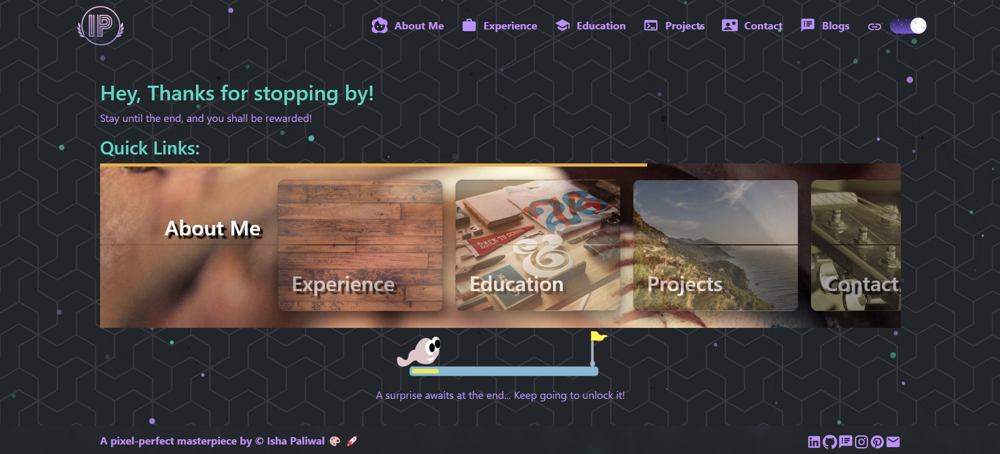
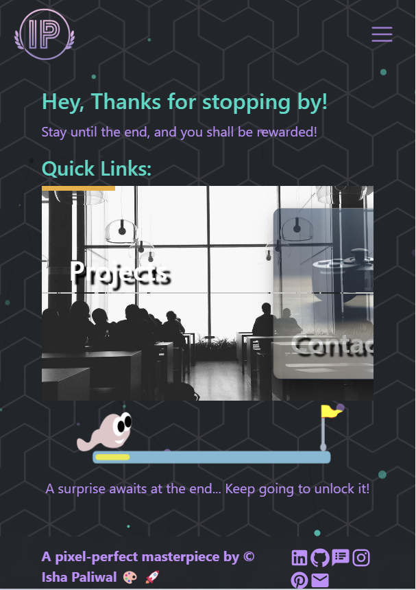

# Isha Paliwal - Developer Portfolio

Welcome to my interactive developer portfolio! This site is a culmination of my passion for web development, showcasing my projects, experiences, and a touch of creativity.

## Features

- **Interactive Journey:** Navigate through sections guided by Lottie animations.
- **3D Game Finale:** Enjoy a React Three Fiber game in the Contact section, adapted from [this tutorial](https://javascriptgametutorials.com/tutorials/react-three-fiber/crossy-road).
- **Dynamic Projects Section:** Filter projects by name, tech stack, or status.
- **Responsive Design:** Seamless experience across devices with a hamburger menu on smaller screens.
- **Theme Toggle:** Switch between dark and light modes with animated icons.
- **Contact Form:** Reach out directly via EmailJS integration.
- **Background pattern:** Designed using [Pattern.Monster](https://pattern.monster)

## Tech Stack

- **Frontend:** React.js, HTML5, CSS3
- **UI Components:** Material UI, React-Bootstrap
- **Animations:** Lottie
- **3D Graphics:** Three.js, React Three Fiber
- **Email Service:** EmailJS

## Screenshots

### Desktop View


### Mobile View


### Projects Section


### 3D Game


---

## Extra Libraries & Functionalities

| Library / Tool            | Purpose                                         |
|---------------------------|-------------------------------------------------|
| `react-icons`             | Icons across navbar and footer                  |
| `react-scroll`            | Smooth scrolling to sections                    |
| `react-switch`            | Toggle for Dark Mode                           |
| `react-router-dom`        | Routing between different pages (if used)       |
| `pdf.worker.min.js`       | PDF rendering functionality (PDF.js)           |
| `three`, `@react-three/fiber` | Game rendering with Three.js in Contact page   |
| `react-slick` or similar  | For Image Carousel in Experience section        |
| Custom filtering logic    | Used for Project card filtering (name, status, tech) |
| `_redirects` file         | Netlify-compatible routing                      |

---

## Game Credit

The Crossy Road-style game embedded in the **Contact** section is built using **Three.js** and React Three Fiber, inspired by this amazing tutorial:  
[Crossy Road Game Tutorial](https://javascriptgametutorials.com/tutorials/react-three-fiber/crossy-road)

---

## Folder Structure (Main Parts)

```
isha-paliwal-portfolio-app/
├── public/
│   ├── assets/         # Images, resume, logos
│   └── index.html
├── src/
│   ├── App.jsx
│   ├── App.css
│   └── ...components
├── screenshot-desktop.png
├── screenshot-mobile.png
├── package.json
└── README.md
```

---

_A pixel-perfect masterpiece by © Isha Paliwal_
